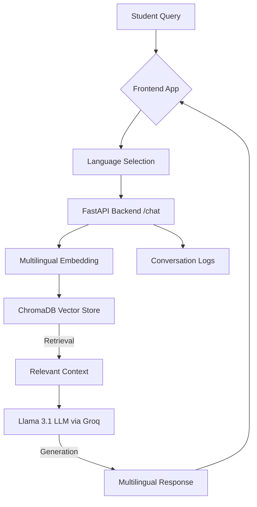

<div align="center">
  <h1>🌍 Campus Assistant AI</h1>
  <h3>The Ultimate "Pan-India" Language-Agnostic RAG Chatbot</h3>
</div>

<br />

## 🎯 The Problem
Campus offices handle thousands of repetitive student queries every semester regarding fees, scholarships, and schedules. A massive **communication gap** exists when students prefer regional languages like Hindi, Marathi, or Tamil, while institutional information remains buried in English PDFs.

## 🚀 The Solution
**Campus Assistant AI** is a multilingual conversational chatbot that shatters language barriers. It dynamically reads English PDFs and circulars, then answers student queries with hyper-accurate facts in **any of the 10+ major Indian languages** using a Retrieval-Augmented Generation (RAG) architecture.

---

## 🏗️ Model Architecture


---

## ✨ Key Features
- **🗣️ Pan-India Multilingual Support:** Native support for 10+ languages: English, Hindi, Marathi, Bengali, Tamil, Telugu, Malayalam, Kannada, Gujarati, Punjabi, and Urdu.
- **📚 Zero-Training Ingestion:** Drag and drop PDFs/TXT circulars into `backend/data/`.
- **⚡ Advanced RAG Pipeline:** Powered by **Llama 3.1** via Groq for sub-second responses.
- **💻 Multilingual Embeddings:** Uses `paraphrase-multilingual-MiniLM-L12-v2` for cross-lingual understanding.
- **📄 Dynamic Contact Retrieval:** Automatically finds and provides office contact details from documents.
- **📊 Conversation Logging:** Integrated logging for evaluation and future model improvement.

---

## 🛠️ Technology Stack
- **Frontend:** React 18, TypeScript, Tailwind CSS, shadcn/ui.
- **Backend:** Python 3.11, FastAPI, LangChain.
- **AI/ML:** Llama 3.1 (LLM), ChromaDB (Vector DB), HuggingFace (Embeddings).

---

## 💻 Getting Started

### 1. Setup Backend
```bash
cd backend
python -m venv venv
.\venv\Scripts\activate
pip install -r requirements.txt
```
Create `.env` in `backend/` with `GROQ_API_KEY="your_key"`.

### 2. Setup Frontend
```bash
cd frontend
npm install
npm run dev
```

---

## 📜 Citations & Credits
This project utilizes the following open-source models and libraries:
- **Meta Llama 3.1 8B**: Large Language Model for multilingual reasoning.
- **HuggingFace paraphrase-multilingual-MiniLM-L12-v2**: Multilingual sentence embeddings.
- **LangChain**: Framework for building context-aware RAG applications.
- **ChromaDB**: High-performance local vector database.
- **Lucide React**: Iconography for the user interface.

---

## 📊 Expected Outcomes
- **Multilingual performance**: Native responses in 10+ Indian languages.
- **Usability**: Clean, responsive interface for mobile and web.
- **Reliability**: Fallback to human support when information is missing.
